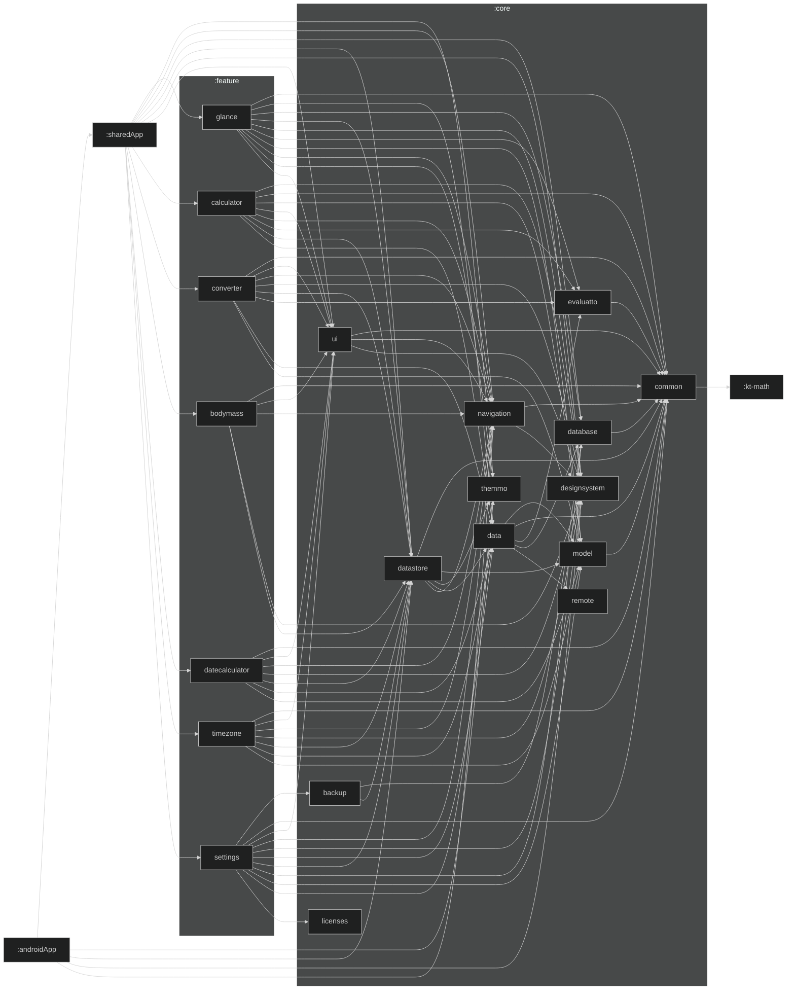

# Architecture

This page contains information about app architecture.

## Module ~~spaghetti~~ Graph

```mermaid
%%{
  init: {
    'theme': 'dark'
  }
}%%

graph LR
  subgraph :core
    :core:database["database"]
    :core:common["common"]
    :core:backup["backup"]
    :core:ui["ui"]
    :core:navigation["navigation"]
    :core:designsystem["designsystem"]
    :core:data["data"]
    :core:datastore["datastore"]
    :core:model["model"]
    :core:themmo["themmo"]
    :core:licenses["licenses"]
    :core:evaluatto["evaluatto"]
    :core:remote["remote"]
  end
  subgraph :feature
    :feature:settings["settings"]
    :feature:glance["glance"]
    :feature:calculator["calculator"]
    :feature:converter["converter"]
    :feature:bodymass["bodymass"]
    :feature:datecalculator["datecalculator"]
    :feature:timezone["timezone"]
  end
  :core:database --> :core:common
  :core:common --> :kt-math
  :feature:settings --> :core:backup
  :feature:settings --> :core:common
  :feature:settings --> :core:ui
  :feature:settings --> :core:navigation
  :feature:settings --> :core:designsystem
  :feature:settings --> :core:data
  :feature:settings --> :core:datastore
  :feature:settings --> :core:database
  :feature:settings --> :core:model
  :feature:settings --> :core:themmo
  :feature:settings --> :core:licenses
  :core:evaluatto --> :core:common
  :sharedApp --> :feature:glance
  :sharedApp --> :core:themmo
  :sharedApp --> :core:navigation
  :sharedApp --> :core:database
  :sharedApp --> :core:datastore
  :sharedApp --> :core:designsystem
  :sharedApp --> :core:ui
  :sharedApp --> :feature:calculator
  :sharedApp --> :feature:converter
  :sharedApp --> :feature:bodymass
  :sharedApp --> :feature:datecalculator
  :sharedApp --> :feature:timezone
  :sharedApp --> :feature:settings
  :androidApp --> :sharedApp
  :androidApp --> :core:themmo
  :androidApp --> :core:datastore
  :androidApp --> :core:designsystem
  :androidApp --> :core:navigation
  :core:datastore --> :core:common
  :core:datastore --> :core:model
  :core:datastore --> :core:themmo
  :core:datastore --> :core:data
  :core:datastore --> :core:navigation
  :feature:bodymass --> :core:common
  :feature:bodymass --> :core:ui
  :feature:bodymass --> :core:navigation
  :feature:bodymass --> :core:designsystem
  :feature:bodymass --> :core:datastore
  :core:model --> :core:common
  :feature:calculator --> :core:designsystem
  :feature:calculator --> :core:common
  :feature:calculator --> :core:model
  :feature:calculator --> :core:ui
  :feature:calculator --> :core:navigation
  :feature:calculator --> :core:evaluatto
  :feature:calculator --> :core:datastore
  :feature:calculator --> :core:data
  :feature:converter --> :core:common
  :feature:converter --> :core:ui
  :feature:converter --> :core:navigation
  :feature:converter --> :core:designsystem
  :feature:converter --> :core:datastore
  :feature:converter --> :core:evaluatto
  :feature:converter --> :core:data
  :feature:converter --> :core:model
  :feature:timezone --> :core:common
  :feature:timezone --> :core:ui
  :feature:timezone --> :core:navigation
  :feature:timezone --> :core:designsystem
  :feature:timezone --> :core:datastore
  :feature:timezone --> :core:data
  :feature:timezone --> :core:model
  :feature:datecalculator --> :core:common
  :feature:datecalculator --> :core:ui
  :feature:datecalculator --> :core:navigation
  :feature:datecalculator --> :core:designsystem
  :feature:datecalculator --> :core:datastore
  :feature:datecalculator --> :core:data
  :feature:datecalculator --> :core:model
  :core:data --> :core:model
  :core:data --> :core:common
  :core:data --> :core:evaluatto
  :core:data --> :core:database
  :core:data --> :core:remote
  :core:ui --> :core:common
  :core:ui --> :core:navigation
  :core:ui --> :core:designsystem
  :feature:glance --> :core:common
  :feature:glance --> :core:data
  :feature:glance --> :core:database
  :feature:glance --> :core:datastore
  :feature:glance --> :core:designsystem
  :feature:glance --> :core:evaluatto
  :feature:glance --> :core:model
  :feature:glance --> :core:navigation
  :feature:glance --> :core:themmo
  :feature:glance --> :core:ui
  :core:backup --> :core:database
  :core:backup --> :core:datastore
  :core:navigation --> :core:common
  :core:navigation --> :core:designsystem
```