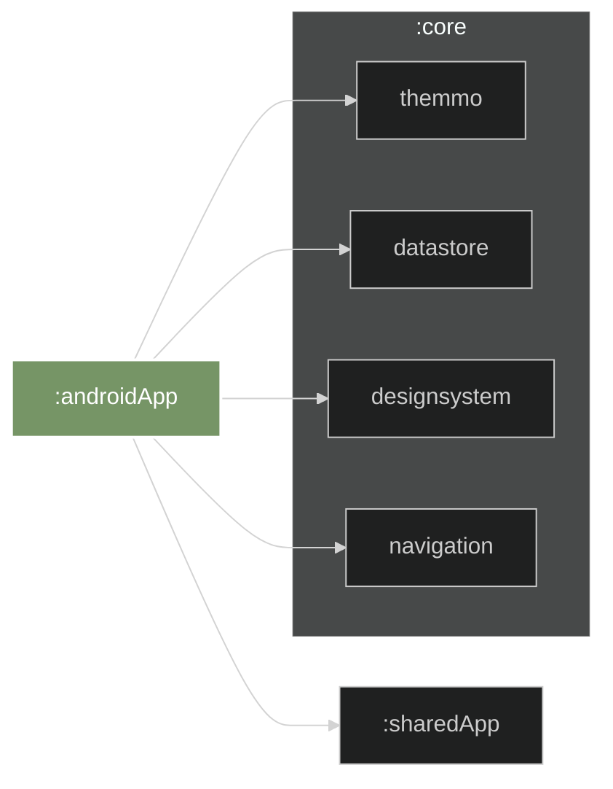

## Graph

```mermaid
%%{
  init: {
    'theme': 'dark'
  }
}%%

graph LR
  subgraph :core
    :core:themmo["themmo"]
    :core:datastore["datastore"]
    :core:designsystem["designsystem"]
    :core:navigation["navigation"]
  end
  :androidApp --> :sharedApp
  :androidApp --> :core:themmo
  :androidApp --> :core:datastore
  :androidApp --> :core:designsystem
  :androidApp --> :core:navigation

classDef focus fill:#769566,stroke:#fff,stroke-width:2px,color:#fff;
class :androidApp focus
```