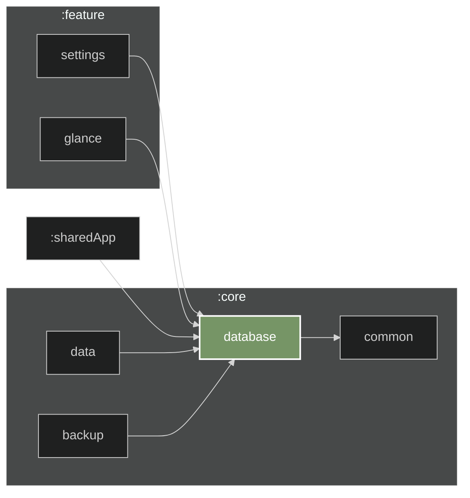

# Database module

Database with user data. ALWAYS CHECK migrations if you make any changes here.

## Graph

```mermaid
%%{
  init: {
    'theme': 'dark'
  }
}%%

graph LR
  subgraph :core
    :core:database["database"]
    :core:common["common"]
    :core:data["data"]
    :core:backup["backup"]
  end
  subgraph :feature
    :feature:settings["settings"]
    :feature:glance["glance"]
  end
  :core:database --> :core:common
  :feature:settings --> :core:database
  :sharedApp --> :core:database
  :core:data --> :core:database
  :feature:glance --> :core:database
  :core:backup --> :core:database

classDef focus fill:#769566,stroke:#fff,stroke-width:2px,color:#fff;
class :core:database focus
```