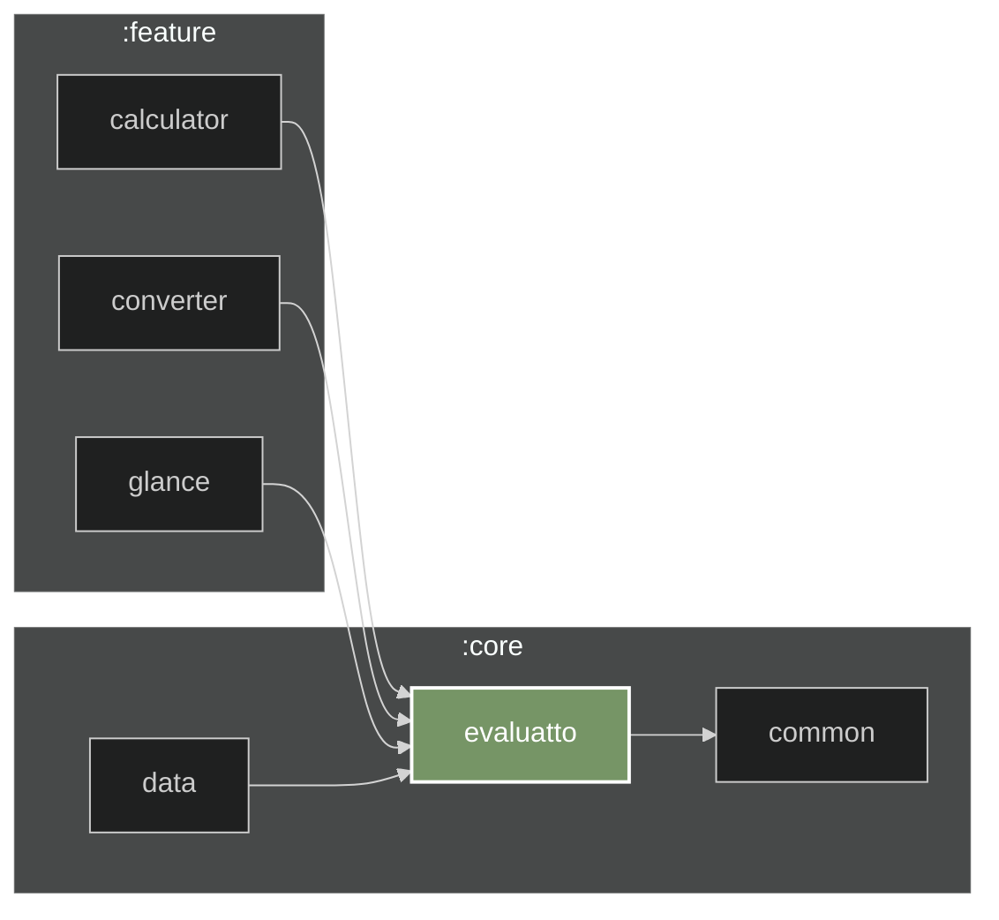

# Evaluattoâ„¢

Best expression evaluator. Do not contribute! Coupled with token system.

## Graph

```mermaid
%%{
  init: {
    'theme': 'dark'
  }
}%%

graph LR
  subgraph :core
    :core:evaluatto["evaluatto"]
    :core:common["common"]
    :core:data["data"]
  end
  subgraph :feature
    :feature:calculator["calculator"]
    :feature:converter["converter"]
    :feature:glance["glance"]
  end
  :core:evaluatto --> :core:common
  :feature:calculator --> :core:evaluatto
  :feature:converter --> :core:evaluatto
  :core:data --> :core:evaluatto
  :feature:glance --> :core:evaluatto

classDef focus fill:#769566,stroke:#fff,stroke-width:2px,color:#fff;
class :core:evaluatto focus
```