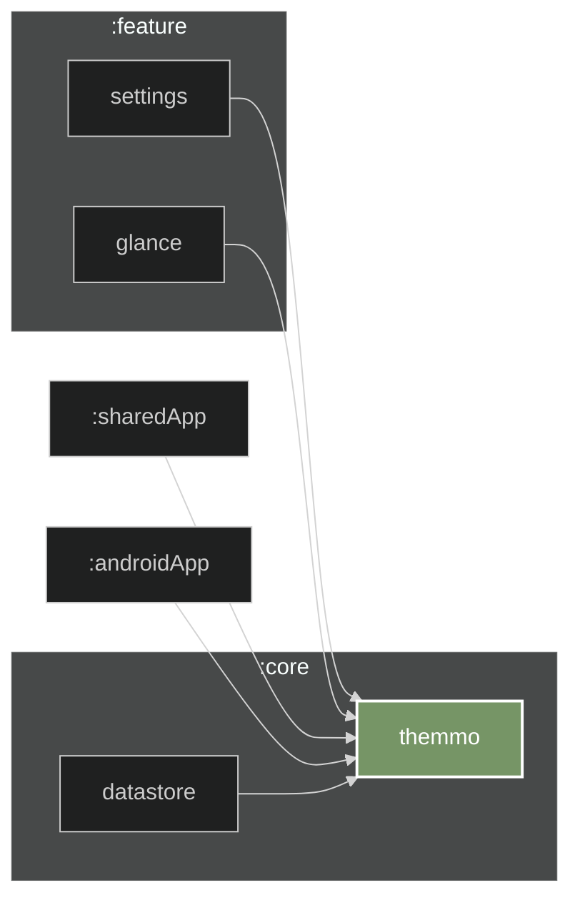

# Themmo

Advanced theming controls. ALWAYS test on different Android versions!

## Graph

```mermaid
%%{
  init: {
    'theme': 'dark'
  }
}%%

graph LR
  subgraph :core
    :core:themmo["themmo"]
    :core:datastore["datastore"]
  end
  subgraph :feature
    :feature:settings["settings"]
    :feature:glance["glance"]
  end
  :feature:settings --> :core:themmo
  :sharedApp --> :core:themmo
  :androidApp --> :core:themmo
  :core:datastore --> :core:themmo
  :feature:glance --> :core:themmo

classDef focus fill:#769566,stroke:#fff,stroke-width:2px,color:#fff;
class :core:themmo focus
```