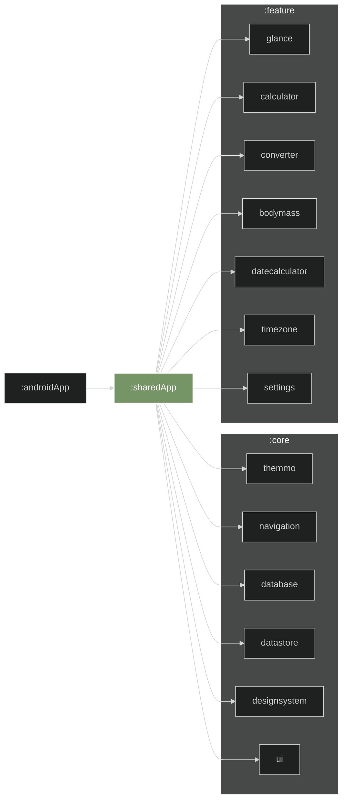

# App module

Main module that glues everything together. Navigation host and Themmo live here.

## Graph

```mermaid
%%{
  init: {
    'theme': 'dark'
  }
}%%

graph LR
  subgraph :core
    :core:themmo["themmo"]
    :core:navigation["navigation"]
    :core:database["database"]
    :core:datastore["datastore"]
    :core:designsystem["designsystem"]
    :core:ui["ui"]
  end
  subgraph :feature
    :feature:glance["glance"]
    :feature:calculator["calculator"]
    :feature:converter["converter"]
    :feature:bodymass["bodymass"]
    :feature:datecalculator["datecalculator"]
    :feature:timezone["timezone"]
    :feature:settings["settings"]
  end
  :sharedApp --> :feature:glance
  :sharedApp --> :core:themmo
  :sharedApp --> :core:navigation
  :sharedApp --> :core:database
  :sharedApp --> :core:datastore
  :sharedApp --> :core:designsystem
  :sharedApp --> :core:ui
  :sharedApp --> :feature:calculator
  :sharedApp --> :feature:converter
  :sharedApp --> :feature:bodymass
  :sharedApp --> :feature:datecalculator
  :sharedApp --> :feature:timezone
  :sharedApp --> :feature:settings
  :androidApp --> :sharedApp

classDef focus fill:#769566,stroke:#fff,stroke-width:2px,color:#fff;
class :sharedApp focus
```